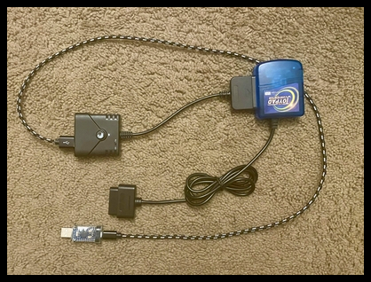
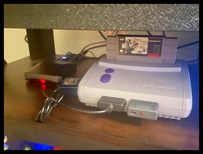

# SNES-bot

## Synopsis:
This is a Discord bot minigame written in Python that allows players to control an authentic Super Nintendo  
console from the '90s with emoji reactions and messages like Twitch Plays Pokemon!

## How It Works:
Python code converts PS3 controller signals into PS2 signals and then into SNES signals

The Discord bot and SNES video feed are hosted on a Raspberry Pi 4

## Example Videos:
[YouTube demonstration](https://youtu.be/RbavAC5LDEk?t=463)  
[Professor LeMieux demonstration](https://www.youtube.com/watch?v=mZoVbxi-5-Y&t=15762s)

## Requirements:
* [Python 3.7](https://www.python.org/)
* [Discord Library](https://pypi.org/project/discord.py/) - *pip install discord*
* On [Windows](https://www.codegrepper.com/code-examples/whatever/discord+ssl+certificate+error) and [Mac](https://pastebin.com/8Cs0C8c4) download a Discord certificate
* [GIMX Adapter and Launcher](https://blog.gimx.fr/product/gimx-adapter/) to convert Discord interactions into PS3 controller signals
* [Brook Adapter](https://www.amazon.com/BROOK-GAME-CONTROLLER-SUPER-CONVERTER/dp/B07543W7XS) to convert PS3 controller signals into PS2 controller signals
* [Tototek Adapter](http://www.tototek.com/store/index.php?main_page=product_info&products_id=53) to convert PS2 controller signals into SNES controller signals

## Usage:
* Put your Discord bot token into Token.txt
* In the GIMX launcher, *Output: GIMX adapter, Input: Network, IP: 127.0.0.1:51914, Messages: None*
* In your terminal: *python SNES-bot.py*

## Support:
* Windows :heavy_check_mark:
* Linux: :heavy_check_mark:
* Mac: :heavy_check_mark:

## Special Thanks:
* Professor LeMieux for helping me play-test this Discord bot!
